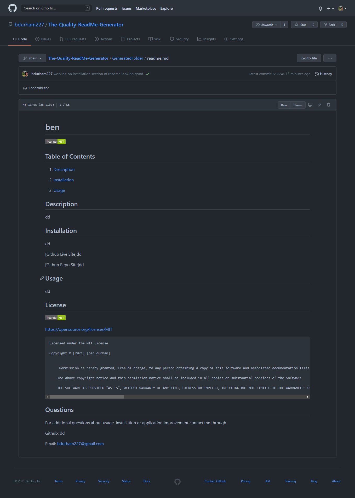

# The Quality ReadMe Generator Application

 ## Table of Contents
1. [Description](#description)

2. [Installation](#installation)

3. [Usage](#usage)

4. [Contributions](#contributions)

5. [Questions](#questions)

-----

## Description
 This a command-line application that uses the inquirer npm to prompt the user with a series of questions and takes their input responses to generate a ReadMe markdown file. This application looks to save the user time by eliminating the need to create ReadMe.Md files for every project they create and post to Github. Creating this application helped me learn and practice using node, npm packages, and creating content dynamically with Javascript.

 -----

 ## Installation
 

   Getting Started:
   * check node is installed
   * npm installed
   * npm initialized
   * npm init
   * package.json and dependencies
  
    node -v
    npm install
    npm init --yes
    npm i inquirer

  

 ## Usage

 ---

 Run the Application:
 

      node index.js
   
Watch Walkthrough video: 
--
[video] https://drive.google.com/file/d/1_Wcx5O6WhLq13bu2jyC0ehrvm0ivZQwX/preview 

Screenshot of Generated Readme:
--

Visit the Repo: 
[Github]**<https://github.com/bdurham227/The-Quality-ReadMe-Generator>**

   

 ## License
 

   https://opensource.org/licenses/MIT

    Licensed under the MIT License

    Copyright © [2021] [Benjamin Durham]
    

         Permission is hereby granted, free of charge, to any person obtaining a copy of this software and associated documentation files (the "Software"), to deal in the Software without restriction, including without limitation the rights to use, copy, modify, merge, publish, distribute, sublicense, and/or sell copies of the Software, and to permit persons to whom the Software is furnished to do so, subject to the following conditions:
        
        The above copyright notice and this permission notice shall be included in all copies or substantial portions of the Software.
        
        THE SOFTWARE IS PROVIDED "AS IS", WITHOUT WARRANTY OF ANY KIND, EXPRESS OR IMPLIED, INCLUDING BUT NOT LIMITED TO THE WARRANTIES OF MERCHANTABILITY, FITNESS FOR A PARTICULAR PURPOSE AND NONINFRINGEMENT. IN NO EVENT SHALL THE AUTHORS OR COPYRIGHT HOLDERS BE LIABLE FOR ANY CLAIM, DAMAGES OR OTHER LIABILITY, WHETHER IN AN ACTION OF CONTRACT, TORT OR OTHERWISE, ARISING FROM, OUT OF OR IN CONNECTION WITH THE SOFTWARE OR THE USE OR OTHER DEALINGS IN THE SOFTWARE

## Contribution
---

Jason Barbanel 
 
https://github.com/Jbarbss
 
Takuya Matsomoto
 
https://github.com/TakuyaMats

 ## Questions
 ---
 For additional questions about usage, installation or application improvement contact me through

Github: https://github.com/bdurham227

Email: bdurham227@gmail.com